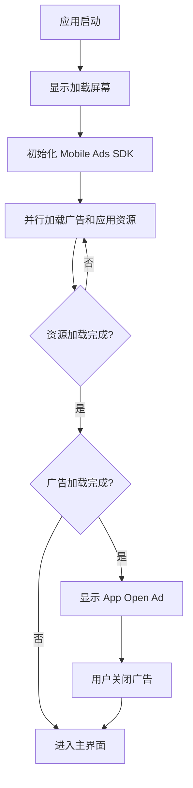

# 第 9 章：冷启动与加载屏幕

## 章节简介

在本章中，我们将学习如何处理应用冷启动场景。冷启动是指应用在未预先加载到内存的情况下启动。在这种情况下，App Open Ads 可能尚未加载完成，直接显示会导致糟糕的用户体验。我们将学习如何使用加载屏幕策略来优化用户体验。

## 什么是冷启动

### 冷启动 vs 热启动

**冷启动（Cold Start）**：

- 应用完全关闭后重新启动
- 应用进程不在内存中
- 需要重新初始化所有资源
- App Open Ad 尚未加载

**热启动（Warm Start）**：

- 应用在后台运行，切换到前台
- 应用进程仍在内存中
- 资源已初始化
- App Open Ad 可能已预加载

### 冷启动的问题

在冷启动场景中：

1. **广告未加载**：应用启动时，App Open Ad 尚未加载完成
2. **加载延迟**：广告加载通常需要 1-3 秒
3. **用户体验差**：如果用户在广告加载完成前就开始使用应用，突然弹出的广告会打断用户操作

## 加载屏幕策略

### 推荐方案

**关键点**：在冷启动时，应该使用加载屏幕来加载应用资源，并且只在加载屏幕上显示 App Open Ad。如果应用已完成加载并进入主内容，就不应该再显示广告。

### 实现思路

1. **显示加载屏幕**：应用启动时显示加载屏幕
2. **后台加载资源**：在后台线程加载应用资源
3. **加载广告**：同时加载 App Open Ad
4. **显示广告**：如果广告加载完成，在加载屏幕上显示
5. **进入主内容**：加载完成后进入应用主界面

## 实现加载屏幕

### 1. 创建加载屏幕 Widget

```dart
class LoadingScreen extends StatefulWidget {
  const LoadingScreen({super.key});

  @override
  State<LoadingScreen> createState() => _LoadingScreenState();
}

class _LoadingScreenState extends State<LoadingScreen> {
  final _appOpenAdManager = AppOpenAdManager();
  bool _isLoading = true;
  bool _adShown = false;

  @override
  void initState() {
    super.initState();
    _initializeApp();
  }

  Future<void> _initializeApp() async {
    // 1. 初始化 Mobile Ads SDK
    await MobileAds.instance.initialize();

    // 2. 加载广告
    _appOpenAdManager.loadAd();

    // 3. 加载应用资源（在后台进行）
    await _loadAppResources();

    // 4. 检查广告是否可用并显示
    if (_appOpenAdManager.isAdAvailable && !_adShown) {
      _appOpenAdManager.showAdIfAvailable();
      _adShown = true;
    }

    // 5. 等待广告关闭后进入主界面
    // 注意：这里需要等待广告关闭，实际实现可能需要更复杂的逻辑
    setState(() {
      _isLoading = false;
    });
  }

  Future<void> _loadAppResources() async {
    // 模拟加载应用资源
    await Future.delayed(const Duration(seconds: 2));
  }

  @override
  Widget build(BuildContext context) {
    if (_isLoading) {
      return Scaffold(
        body: Center(
          child: Column(
            mainAxisAlignment: MainAxisAlignment.center,
            children: [
              CircularProgressIndicator(),
              SizedBox(height: 20),
              Text('Loading...'),
            ],
          ),
        ),
      );
    }

    // 加载完成后导航到主界面
    WidgetsBinding.instance.addPostFrameCallback((_) {
      Navigator.of(context).pushReplacement(
        MaterialPageRoute(builder: (_) => HomePage()),
      );
    });

    return Scaffold(body: Container());
  }
}
```

### 2. 改进的实现

上面的实现是简化版本。在实际应用中，需要更复杂的逻辑来处理广告显示和资源加载的时序。以下是改进版本：

```dart
class LoadingScreen extends StatefulWidget {
  const LoadingScreen({super.key});

  @override
  State<LoadingScreen> createState() => _LoadingScreenState();
}

class _LoadingScreenState extends State<LoadingScreen> {
  final _appOpenAdManager = AppOpenAdManager();
  bool _resourcesLoaded = false;
  bool _adShown = false;
  bool _adDismissed = false;

  @override
  void initState() {
    super.initState();
    _initializeApp();
  }

  Future<void> _initializeApp() async {
    // 1. 初始化 Mobile Ads SDK
    await MobileAds.instance.initialize();

    // 2. 并行加载广告和应用资源
    final adLoadFuture = _loadAd();
    final resourcesLoadFuture = _loadAppResources();

    // 等待两者都完成
    await Future.wait([adLoadFuture, resourcesLoadFuture]);

    _resourcesLoaded = true;

    // 3. 如果广告可用且资源已加载，显示广告
    if (_appOpenAdManager.isAdAvailable && !_adShown) {
      _showAdAndWait();
    } else {
      // 如果没有广告，直接进入主界面
      _navigateToHome();
    }
  }

  Future<void> _loadAd() async {
    _appOpenAdManager.loadAd();
    // 等待广告加载（最多等待 3 秒）
    final startTime = DateTime.now();
    while (!_appOpenAdManager.isAdAvailable &&
        DateTime.now().difference(startTime).inSeconds < 3) {
      await Future.delayed(const Duration(milliseconds: 100));
    }
  }

  Future<void> _loadAppResources() async {
    // 加载应用资源（图片、数据等）
    // 在实际应用中，这里应该加载真实的资源
    await Future.delayed(const Duration(seconds: 2));
  }

  Future<void> _showAdAndWait() async {
    _adShown = true;
    _appOpenAdManager.showAdIfAvailable();

    // 等待广告关闭
    // 注意：实际实现中，应该通过回调来通知广告关闭
    // 这里使用延迟作为示例
    await Future.delayed(const Duration(seconds: 5));
    _adDismissed = true;
    _navigateToHome();
  }

  void _navigateToHome() {
    if (mounted) {
      Navigator.of(context).pushReplacement(
        MaterialPageRoute(builder: (_) => HomePage()),
      );
    }
  }

  @override
  Widget build(BuildContext context) {
    return Scaffold(
      body: Center(
        child: Column(
          mainAxisAlignment: MainAxisAlignment.center,
          children: [
            CircularProgressIndicator(),
            SizedBox(height: 20),
            Text('Loading...'),
            if (_resourcesLoaded && _adShown && !_adDismissed)
              Padding(
                padding: EdgeInsets.only(top: 20),
                child: Text('Ad is showing...'),
              ),
          ],
        ),
      ),
    );
  }
}
```

## 使用回调通知广告关闭

更好的方法是使用回调来通知广告关闭。我们需要修改 `AppOpenAdManager` 来支持回调：

```dart
class AppOpenAdManager {
  // ... 其他代码 ...

  VoidCallback? onAdDismissed;

  void showAdIfAvailable() {
    // ... 现有代码 ...

    _appOpenAd!.fullScreenContentCallback = FullScreenContentCallback(
      // ... 其他回调 ...
      onAdDismissedFullScreenContent: (ad) {
        debugPrint('$ad onAdDismissedFullScreenContent');
        _isShowingAd = false;
        ad.dispose();
        _appOpenAd = null;
        _appOpenLoadTime = null;
        loadAd();
        
        // 通知监听者广告已关闭
        onAdDismissed?.call();
      },
    );
    
    _appOpenAd!.show();
  }
}
```

然后在加载屏幕中使用：

```dart
Future<void> _showAdAndWait() async {
  final completer = Completer<void>();
  
  _appOpenAdManager.onAdDismissed = () {
    completer.complete();
  };
  
  _adShown = true;
  _appOpenAdManager.showAdIfAvailable();
  
  await completer.future;
  _adDismissed = true;
  _navigateToHome();
}
```

## 后台线程资源加载

### 关键点

**重要**：为了在显示 App Open Ad 的同时继续加载应用资源，应该始终在后台线程中加载资源。

### 在 Flutter 中实现

Flutter 的 `Future` 默认在后台执行，但为了确保不阻塞 UI，可以使用 `compute` 函数：

```dart
import 'package:flutter/foundation.dart';

Future<void> _loadAppResources() async {
  // 使用 compute 在隔离线程中加载资源
  await compute(_loadResourcesInBackground, null);
}

static Future<void> _loadResourcesInBackground(_) async {
  // 加载图片、数据等资源
  // 这个函数在隔离线程中运行，不会阻塞 UI
}
```

或者简单地使用 `Future`：

```dart
Future<void> _loadAppResources() async {
  // 这些操作默认在后台执行
  await Future.wait([
    _loadImages(),
    _loadData(),
    _initializeServices(),
  ]);
}
```

## 避免不良用户体验

### 不应该做的

1. **在主界面显示广告**：如果应用已经进入主界面，不应该再显示 App Open Ad
2. **打断用户操作**：不应该在用户正在操作时突然显示广告
3. **重复显示**：不应该在短时间内重复显示广告

### 应该做的

1. **只在加载屏幕显示**：只在加载屏幕上显示 App Open Ad
2. **预加载资源**：在显示广告的同时加载应用资源
3. **平滑过渡**：广告关闭后平滑过渡到主界面

## 完整的冷启动处理流程



## 实践练习

完成以下练习以巩固本章内容：

1. **创建加载屏幕**：创建一个 `LoadingScreen` Widget
2. **实现资源加载**：实现应用资源的后台加载逻辑
3. **集成广告显示**：在加载屏幕上集成 App Open Ad 显示
4. **处理时序**：确保广告显示和资源加载的正确时序
5. **测试冷启动**：完全关闭应用后重新启动，测试冷启动场景

## 总结检查清单

完成本章学习后，你应该能够：

- [ ] 理解冷启动和热启动的区别
- [ ] 理解冷启动场景中的问题
- [ ] 理解加载屏幕策略
- [ ] 创建加载屏幕 Widget
- [ ] 实现应用资源的后台加载
- [ ] 在加载屏幕上集成 App Open Ad
- [ ] 处理广告显示和资源加载的时序
- [ ] 避免在主界面显示广告
- [ ] 优化用户体验

## 下一步

现在我们已经学习了如何处理冷启动场景。在下一章中，我们将整合所有知识，创建一个完整的集成示例，展示如何将所有组件组合在一起。

继续学习：[第 10 章：完整集成示例](chapter-10-complete-integration.md)
