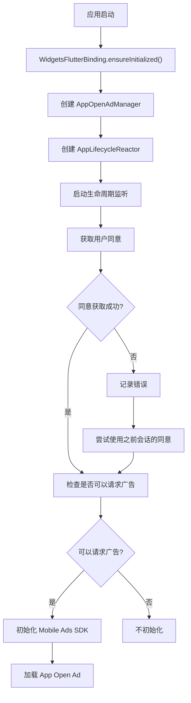
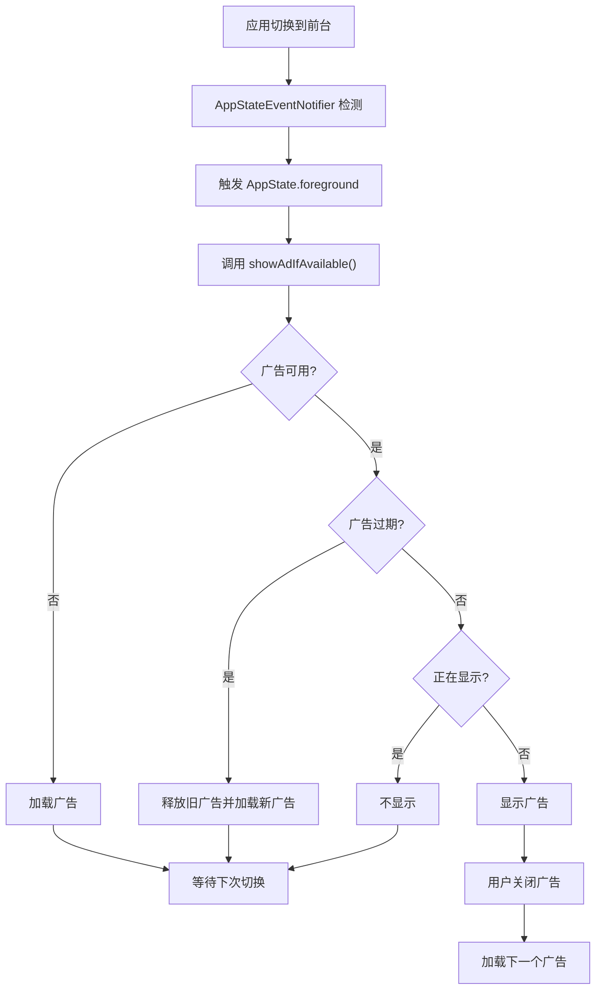

# 第 10 章：完整集成示例

## 章节简介

在本章中，我们将整合前面所有章节的知识，创建一个完整的 App Open Ads 集成示例。我们将展示如何将所有组件（广告管理器、生命周期监听、同意管理）组合在一起，创建一个可以实际使用的完整应用。

## 完整项目结构

在开始之前，让我们回顾一下完整的项目结构：

```text
lib/
  ├── main.dart                    # 应用入口
  ├── app_open_ad_manager.dart     # 广告管理器
  ├── app_lifecycle_reactor.dart    # 生命周期监听
  └── consent_manager.dart         # 同意管理
```

## 完整的 main.dart

以下是完整的 `main.dart` 实现，整合了所有功能：

```dart
import 'package:flutter/material.dart';
import 'package:google_mobile_ads/google_mobile_ads.dart';

import '../../../../../flutter-app-open-ads-tutorial/app_bar_item.dart';
import '../../../../../flutter-app-open-ads-tutorial/app_lifecycle_reactor.dart';
import '../../../../../flutter-app-open-ads-tutorial/app_open_ad_manager.dart';
import '../../../../../flutter-app-open-ads-tutorial/consent_manager.dart';

void main() {
  WidgetsFlutterBinding.ensureInitialized();
  runApp(const MainApp());
}

class MainApp extends StatelessWidget {
  const MainApp({super.key});

  @override
  Widget build(BuildContext context) {
    return MaterialApp(
      theme: ThemeData(primarySwatch: Colors.blue),
      home: const HomePage(),
    );
  }
}

class HomePage extends StatefulWidget {
  const HomePage({super.key});

  @override
  State<HomePage> createState() => _HomePageState();
}

/// Example home page for an app open ad.
class _HomePageState extends State<HomePage> {
  final _appOpenAdManager = AppOpenAdManager();
  var _isMobileAdsInitializeCalled = false;
  var _isPrivacyOptionsRequired = false;
  late AppLifecycleReactor _appLifecycleReactor;

  @override
  void initState() {
    super.initState();

    // 1. 创建生命周期监听器
    _appLifecycleReactor = AppLifecycleReactor(
      appOpenAdManager: _appOpenAdManager,
    );
    _appLifecycleReactor.listenToAppStateChanges();

    // 2. 获取用户同意
    ConsentManager.instance.gatherConsent((consentGatheringError) {
      if (consentGatheringError != null) {
        // Consent not obtained in current session.
        debugPrint(
          "${consentGatheringError.errorCode}: ${consentGatheringError.message}",
        );
      }

      // 3. 检查是否需要隐私选项入口
      _getIsPrivacyOptionsRequired();

      // 4. 尝试初始化 Mobile Ads SDK
      _initializeMobileAdsSDK();
    });

    // 5. 尝试使用之前会话的同意信息加载广告
    _initializeMobileAdsSDK();
  }

  @override
  Widget build(BuildContext context) {
    return Scaffold(
      appBar: AppBar(
        title: const Text('App Open Demo Home Page'),
        actions: _appBarActions(),
      ),
      body: const Center(
        child: Column(
          mainAxisAlignment: MainAxisAlignment.center,
          children: <Widget>[
            Text('Leave and switch back to the app to see the ad.'),
          ],
        ),
      ),
    );
  }

  List<Widget> _appBarActions() {
    var array = [AppBarItem(AppBarItem.adInpsectorText, 0)];

    if (_isPrivacyOptionsRequired) {
      array.add(AppBarItem(AppBarItem.privacySettingsText, 1));
    }

    return <Widget>[
      PopupMenuButton<AppBarItem>(
        itemBuilder: (context) => array
            .map(
              (item) => PopupMenuItem<AppBarItem>(
                value: item,
                child: Text(item.label),
              ),
            )
            .toList(),
        onSelected: (item) {
          switch (item.value) {
            case 0:
              MobileAds.instance.openAdInspector((error) {
                // Error will be non-null if ad inspector closed due to an error.
              });
            case 1:
              ConsentManager.instance.showPrivacyOptionsForm((formError) {
                if (formError != null) {
                  debugPrint("${formError.errorCode}: ${formError.message}");
                }
              });
          }
        },
      ),
    ];
  }

  /// Redraw the app bar actions if a privacy options entry point is required.
  void _getIsPrivacyOptionsRequired() async {
    if (await ConsentManager.instance.isPrivacyOptionsRequired()) {
      setState(() {
        _isPrivacyOptionsRequired = true;
      });
    }
  }

  /// Initialize the Mobile Ads SDK if the SDK has gathered consent aligned with
  /// the app's configured messages.
  void _initializeMobileAdsSDK() async {
    if (_isMobileAdsInitializeCalled) {
      return;
    }

    if (await ConsentManager.instance.canRequestAds()) {
      _isMobileAdsInitializeCalled = true;

      // Initialize the Mobile Ads SDK.
      MobileAds.instance.initialize();

      // Load an ad.
      _appOpenAdManager.loadAd();
    }
  }
}
```

## 完整的 AppOpenAdManager

```dart
import 'package:app_open_example/consent_manager.dart';
import 'package:flutter/material.dart';
import 'package:google_mobile_ads/google_mobile_ads.dart';
import 'dart:io' show Platform;

/// Utility class that manages loading and showing app open ads.
class AppOpenAdManager {
  /// Maximum duration allowed between loading and showing the ad.
  final Duration maxCacheDuration = const Duration(hours: 4);

  /// Keep track of load time so we don't show an expired ad.
  DateTime? _appOpenLoadTime;

  AppOpenAd? _appOpenAd;
  bool _isShowingAd = false;

  String adUnitId = Platform.isAndroid
      ? 'ca-app-pub-3940256099942544/9257395921'
      : 'ca-app-pub-3940256099942544/5575463023';

  /// Load an [AppOpenAd].
  void loadAd() async {
    // Only load an ad if the Mobile Ads SDK has gathered consent aligned with
    // the app's configured messages.
    var canRequestAds = await ConsentManager.instance.canRequestAds();
    if (!canRequestAds) {
      return;
    }

    AppOpenAd.load(
      adUnitId: adUnitId,
      request: const AdRequest(),
      adLoadCallback: AppOpenAdLoadCallback(
        onAdLoaded: (ad) {
          debugPrint('$ad loaded');
          _appOpenLoadTime = DateTime.now();
          _appOpenAd = ad;
        },
        onAdFailedToLoad: (error) {
          debugPrint('AppOpenAd failed to load: $error');
        },
      ),
    );
  }

  /// Whether an ad is available to be shown.
  bool get isAdAvailable {
    return _appOpenAd != null;
  }

  /// Shows the ad, if one exists and is not already being shown.
  ///
  /// If the previously cached ad has expired, this just loads and caches a
  /// new ad.
  void showAdIfAvailable() {
    if (!isAdAvailable) {
      debugPrint('Tried to show ad before available.');
      loadAd();
      return;
    }
    if (_isShowingAd) {
      debugPrint('Tried to show ad while already showing an ad.');
      return;
    }
    if (DateTime.now().subtract(maxCacheDuration).isAfter(_appOpenLoadTime!)) {
      debugPrint('Maximum cache duration exceeded. Loading another ad.');
      _appOpenAd!.dispose();
      _appOpenAd = null;
      _appOpenLoadTime = null;
      loadAd();
      return;
    }
    // Set the fullScreenContentCallback and show the ad.
    _appOpenAd!.fullScreenContentCallback = FullScreenContentCallback(
      onAdShowedFullScreenContent: (ad) {
        _isShowingAd = true;
        debugPrint('$ad onAdShowedFullScreenContent');
      },
      onAdFailedToShowFullScreenContent: (ad, error) {
        debugPrint('$ad onAdFailedToShowFullScreenContent: $error');
        _isShowingAd = false;
        ad.dispose();
        _appOpenAd = null;
        _appOpenLoadTime = null;
      },
      onAdDismissedFullScreenContent: (ad) {
        debugPrint('$ad onAdDismissedFullScreenContent');
        _isShowingAd = false;
        ad.dispose();
        _appOpenAd = null;
        _appOpenLoadTime = null;
        loadAd();
      },
    );
    _appOpenAd!.show();
  }
}
```

## 完整的 AppLifecycleReactor

```dart
import 'package:flutter/material.dart';
import 'package:app_open_example/app_open_ad_manager.dart';
import 'package:google_mobile_ads/google_mobile_ads.dart';

/// Listens for app foreground events and shows app open ads.
class AppLifecycleReactor {
  final AppOpenAdManager appOpenAdManager;

  AppLifecycleReactor({required this.appOpenAdManager});

  void listenToAppStateChanges() {
    AppStateEventNotifier.startListening();
    AppStateEventNotifier.appStateStream.forEach(
      (state) => _onAppStateChanged(state),
    );
  }

  void _onAppStateChanged(AppState appState) {
    debugPrint('New AppState state: $appState');
    if (appState == AppState.foreground) {
      appOpenAdManager.showAdIfAvailable();
    }
  }
}
```

## 完整的 ConsentManager

```dart
import 'dart:async';
import 'package:google_mobile_ads/google_mobile_ads.dart';

typedef OnConsentGatheringCompleteListener = void Function(FormError? error);

/// The Google Mobile Ads SDK provides the User Messaging Platform (Google's IAB
/// Certified consent management platform) as one solution to capture consent for
/// users in GDPR impacted countries. This is an example and you can choose
/// another consent management platform to capture consent.
class ConsentManager {
  ConsentManager._();
  static final ConsentManager instance = ConsentManager._();

  /// Helper variable to determine if the app can request ads.
  Future<bool> canRequestAds() async {
    return await ConsentInformation.instance.canRequestAds();
  }

  /// Helper variable to determine if the privacy options form is required.
  Future<bool> isPrivacyOptionsRequired() async {
    return await ConsentInformation.instance
            .getPrivacyOptionsRequirementStatus() ==
        PrivacyOptionsRequirementStatus.required;
  }

  /// Helper method to call the Mobile Ads SDK to request consent information
  /// and load/show a consent form if necessary.
  void gatherConsent(
    OnConsentGatheringCompleteListener onConsentGatheringCompleteListener,
  ) {
    // For testing purposes, you can force a DebugGeography of Eea or NotEea.
    ConsentDebugSettings debugSettings = ConsentDebugSettings(
      // debugGeography: DebugGeography.debugGeographyEea,
    );
    ConsentRequestParameters params = ConsentRequestParameters(
      consentDebugSettings: debugSettings,
    );

    // Requesting an update to consent information should be called on every app launch.
    ConsentInformation.instance.requestConsentInfoUpdate(
      params,
      () async {
        ConsentForm.loadAndShowConsentFormIfRequired((loadAndShowError) {
          // Consent has been gathered.
          onConsentGatheringCompleteListener(loadAndShowError);
        });
      },
      (FormError formError) {
        onConsentGatheringCompleteListener(formError);
      },
    );
  }

  /// Helper method to call the Mobile Ads SDK method to show the privacy options form.
  void showPrivacyOptionsForm(
    OnConsentFormDismissedListener onConsentFormDismissedListener,
  ) {
    ConsentForm.showPrivacyOptionsForm(onConsentFormDismissedListener);
  }
}
```

## 应用流程

### 启动流程



### 前台切换流程



## 测试完整集成

### 测试步骤

1. **运行应用**：启动应用，观察初始化流程
2. **检查同意**：如果是首次运行，应该看到同意表单
3. **切换到后台**：按 Home 键切换到后台
4. **切换回前台**：切换回应用，应该看到 App Open Ad
5. **关闭广告**：关闭广告，观察是否加载下一个广告
6. **等待 4 小时**：测试过期检测（或临时修改 `maxCacheDuration`）

### 检查日志

在控制台中，你应该看到类似以下的日志：

```text
New AppState state: AppState.foreground
App Open Ad loaded successfully: Instance of 'AppOpenAd'
Instance of 'AppOpenAd' onAdShowedFullScreenContent
Instance of 'AppOpenAd' onAdDismissedFullScreenContent
App Open Ad loaded successfully: Instance of 'AppOpenAd'
```

## 常见问题排查

### 广告不显示

可能的原因：

1. **SDK 未初始化**：确保调用了 `MobileAds.instance.initialize()`
2. **同意未获取**：检查 `canRequestAds()` 是否返回 `true`
3. **广告未加载**：检查 `isAdAvailable` 是否为 `true`
4. **网络问题**：检查设备网络连接

### 同意表单不显示

可能的原因：

1. **不在 GDPR 地区**：使用 `DebugGeography` 测试
2. **配置错误**：检查 AdMob 控制台配置
3. **测试设备**：确保使用正确的测试设备 ID

### 广告过期检测不工作

可能的原因：

1. **时间戳未记录**：确保在 `onAdLoaded` 中记录时间戳
2. **检测逻辑错误**：检查过期检测代码
3. **时区问题**：确保使用正确的时区

## 实践练习

完成以下练习以巩固本章内容：

1. **整合所有组件**：将所有代码整合到一个完整的应用中
2. **测试完整流程**：测试应用启动、同意获取、广告显示等完整流程
3. **测试各种场景**：测试冷启动、热启动、广告过期等场景
4. **优化代码**：根据实际需求优化代码结构
5. **添加错误处理**：增强错误处理和日志记录

## 总结检查清单

完成本章学习后，你应该能够：

- [ ] 理解完整的项目结构
- [ ] 整合所有组件创建完整应用
- [ ] 理解应用启动流程
- [ ] 理解前台切换流程
- [ ] 测试完整集成
- [ ] 排查常见问题
- [ ] 优化代码结构

## 下一步

现在我们已经完成了完整的集成示例。在最后一章中，我们将学习最佳实践和常见问题，帮助你避免常见错误并优化应用性能。

继续学习：[第 11 章：最佳实践与常见问题](chapter-11-best-practices.md)
