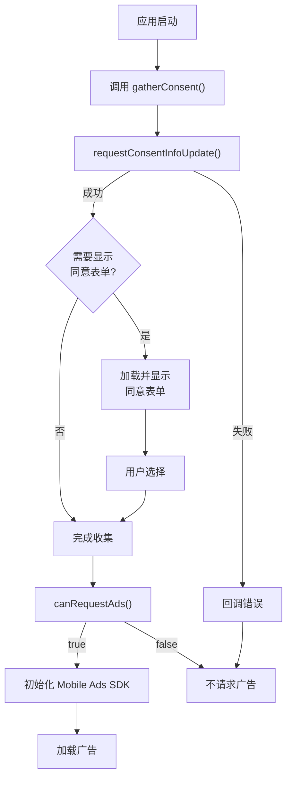

# `lib/consent_manager.dart` 代码讲解

本文档讲解 `ConsentManager` 类的实现，说明其在 GDPR 合规中的作用、核心方法和工作流程。

## 概述

`ConsentManager` 封装了 Google Mobile Ads SDK 提供的 **User Messaging Platform (UMP)** 功能，用于在 GDPR 影响地区收集用户同意。UMP 是 Google 提供的 IAB 认证同意管理平台（CMP），帮助应用合规处理用户隐私选择。

### 核心职责

- 检查应用是否可以请求广告（基于用户同意状态）
- 收集用户同意信息（首次或更新）
- 判断是否需要显示隐私选项入口
- 提供隐私选项表单供用户修改选择

### GDPR 合规背景

根据 GDPR 和 IAB 标准，在欧盟经济区（EEA）等地区，应用在请求个性化广告前必须获得用户明确同意。`ConsentManager` 通过 UMP 平台统一处理这一流程，确保合规性。

## 类结构

```dart 5:11:lib/consent_manager.dart
typedef OnConsentGatheringCompleteListener = void Function(FormError? error);

/// The Google Mobile Ads SDK provides the User Messaging Platform (Google's IAB
/// Certified consent management platform) as one solution to capture consent for
/// users in GDPR impacted countries. This is an example and you can choose
/// another consent management platform to capture consent.
class ConsentManager {
```

`ConsentManager` 是一个工具类，不维护状态，所有方法都是基于 `ConsentInformation.instance` 的单例操作。类中定义了回调类型 `OnConsentGatheringCompleteListener`，用于通知同意收集完成（可能包含错误）。

## 核心方法详解

### `canRequestAds()` - 检查是否可以请求广告

```dart 12:15:lib/consent_manager.dart
  /// Helper variable to determine if the app can request ads.
  Future<bool> canRequestAds() async {
    return await ConsentInformation.instance.canRequestAds();
  }
```

**功能**：检查当前用户同意状态是否允许请求广告。

**返回值**：

- `true`：用户已同意或无需同意（非 GDPR 地区），可以请求广告
- `false`：用户未同意或同意状态未知，不应请求广告

**使用场景**：在初始化 Mobile Ads SDK 和加载广告前调用，确保合规。

### `isPrivacyOptionsRequired()` - 检查隐私选项入口需求

```dart 17:22:lib/consent_manager.dart
  /// Helper variable to determine if the privacy options form is required.
  Future<bool> isPrivacyOptionsRequired() async {
    return await ConsentInformation.instance
            .getPrivacyOptionsRequirementStatus() ==
        PrivacyOptionsRequirementStatus.required;
  }
```

**功能**：判断是否需要在应用中提供隐私选项入口，供用户修改同意选择。

**返回值**：

- `true`：需要显示隐私选项入口（通常在 AppBar 菜单中）
- `false`：不需要显示

**使用场景**：根据返回值决定是否在 UI 中显示 "Privacy Settings" 菜单项。

### `gatherConsent()` - 收集用户同意（核心方法）

```dart 24:50:lib/consent_manager.dart
  /// Helper method to call the Mobile Ads SDK to request consent information
  /// and load/show a consent form if necessary.
  void gatherConsent(
    OnConsentGatheringCompleteListener onConsentGatheringCompleteListener,
  ) {
    // For testing purposes, you can force a DebugGeography of Eea or NotEea.
    ConsentDebugSettings debugSettings = ConsentDebugSettings(
      // debugGeography: DebugGeography.debugGeographyEea,
    );
    ConsentRequestParameters params = ConsentRequestParameters(
      consentDebugSettings: debugSettings,
    );

    // Requesting an update to consent information should be called on every app launch.
    ConsentInformation.instance.requestConsentInfoUpdate(
      params,
      () async {
        ConsentForm.loadAndShowConsentFormIfRequired((loadAndShowError) {
          // Consent has been gathered.
          onConsentGatheringCompleteListener(loadAndShowError);
        });
      },
      (FormError formError) {
        onConsentGatheringCompleteListener(formError);
      },
    );
  }
```

**功能**：请求更新同意信息，并在需要时加载并显示同意表单。

**工作流程**：

1. **创建调试设置**：`ConsentDebugSettings` 用于测试，可强制设置地理位置（`debugGeography`），当前代码中已注释，使用真实地理位置。

2. **构建请求参数**：`ConsentRequestParameters` 包含调试设置，传递给 SDK。

3. **请求同意信息更新**：调用 `ConsentInformation.instance.requestConsentInfoUpdate()`，该方法：
   - 成功回调：检查是否需要显示同意表单，如需则加载并显示
   - 失败回调：通过 `FormError` 通知错误

4. **加载并显示表单**：`ConsentForm.loadAndShowConsentFormIfRequired()` 会：
   - 如果需要显示表单（首次或需要更新），自动加载并展示
   - 如果不需要（已有有效同意），直接完成
   - 通过回调通知完成状态（可能包含错误）

**重要提示**：根据注释，此方法应在每次应用启动时调用，确保同意信息是最新的。

### `showPrivacyOptionsForm()` - 显示隐私选项表单

```dart 52:57:lib/consent_manager.dart
  /// Helper method to call the Mobile Ads SDK method to show the privacy options form.
  void showPrivacyOptionsForm(
    OnConsentFormDismissedListener onConsentFormDismissedListener,
  ) {
    ConsentForm.showPrivacyOptionsForm(onConsentFormDismissedListener);
  }
```

**功能**：显示隐私选项表单，允许用户修改之前的同意选择。

**使用场景**：当 `isPrivacyOptionsRequired()` 返回 `true` 时，在 UI 中提供入口（如 AppBar 菜单），用户点击后调用此方法。

**回调**：表单关闭后通过 `OnConsentFormDismissedListener` 通知，可能包含错误信息。

## 工作流程

以下流程图展示了同意收集的完整流程：



### 流程说明

1. **应用启动时**：调用 `gatherConsent()` 开始同意收集流程
2. **更新同意信息**：SDK 检查当前地理位置和同意状态
3. **判断是否需要表单**：如果需要，自动加载并显示同意表单
4. **用户选择**：用户做出同意或拒绝选择
5. **检查是否可以请求广告**：根据用户选择调用 `canRequestAds()`
6. **初始化 SDK 和加载广告**：只有在可以请求广告时才进行后续操作

## 调试设置

### DebugGeography 使用

在开发测试阶段，可以使用 `DebugGeography` 强制模拟特定地理位置：

```dart
ConsentDebugSettings debugSettings = ConsentDebugSettings(
  debugGeography: DebugGeography.debugGeographyEea,  // 强制模拟 EEA 地区
);
```

**可选值**：

- `DebugGeography.debugGeographyEea`：模拟欧盟经济区，强制显示同意表单
- `DebugGeography.debugGeographyNotEea`：模拟非 EEA 地区，通常不需要同意
- 不设置：使用真实地理位置

**注意事项**：

- 调试设置仅在测试设备上生效
- 生产环境应移除或注释调试设置，使用真实地理位置
- 需要在 AdMob 后台配置测试设备 ID

## 使用注意事项

### 最佳实践

1. **每次启动都调用**：`gatherConsent()` 应在每次应用启动时调用，确保同意信息是最新的。

2. **检查同意状态**：在初始化 Mobile Ads SDK 和加载广告前，必须调用 `canRequestAds()` 检查。

3. **提供隐私入口**：根据 `isPrivacyOptionsRequired()` 的结果，在 UI 中提供隐私选项入口，满足合规要求。

4. **错误处理**：所有回调都可能包含错误，应妥善处理并记录日志。

5. **异步操作**：所有方法都是异步的，使用 `await` 或回调处理结果。

### 常见问题

**Q1：为什么广告不显示？**

A：检查 `canRequestAds()` 返回值。如果为 `false`，说明用户未同意或同意状态未知，不应请求广告。

**Q2：什么时候需要显示隐私选项入口？**

A：当 `isPrivacyOptionsRequired()` 返回 `true` 时，通常发生在用户之前拒绝过同意，或同意状态发生变化时。

**Q3：调试时如何测试同意流程？**

A：使用 `DebugGeography.debugGeographyEea` 强制模拟 EEA 地区，确保每次都能看到同意表单。

**Q4：可以跳过同意检查吗？**

A：不建议。在 GDPR 影响地区，跳过同意检查可能导致违规。应始终遵循合规流程。

**Q5：同意状态会持久化吗？**

A：是的，UMP 平台会持久化用户的同意选择。但每次启动仍应调用 `gatherConsent()` 检查是否有更新。

## 与主应用的集成

在 `main.dart` 中，`ConsentManager` 的使用方式如下：

1. **初始化时收集同意**：在 `initState()` 中调用 `gatherConsent()`
2. **检查是否可以请求广告**：在 `_initializeMobileAdsSDK()` 和 `_loadAd()` 中调用 `canRequestAds()`
3. **显示隐私入口**：根据 `isPrivacyOptionsRequired()` 结果更新 AppBar 菜单
4. **提供隐私选项**：用户点击菜单后调用 `showPrivacyOptionsForm()`

这种设计将同意管理逻辑封装在 `ConsentManager` 中，主应用代码更清晰，易于维护。
