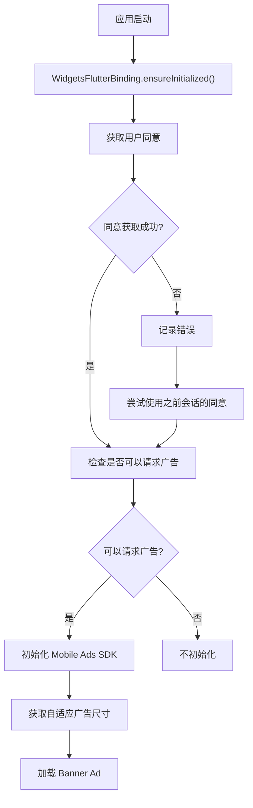
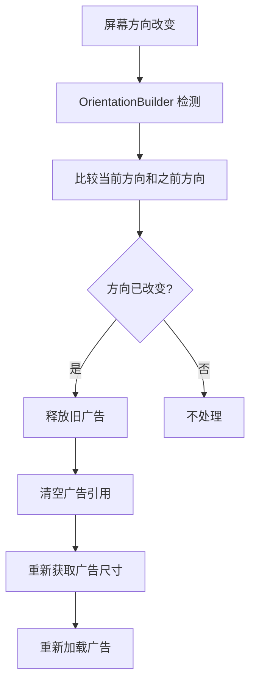

# 第 9 章：完整集成示例

## 章节简介

在本章中，我们将整合前面所有章节的知识，创建一个完整的 Banner Ads 集成示例。我们将展示如何将所有组件（广告加载、显示、方向处理、事件监听、同意管理）组合在一起，创建一个可以实际使用的完整应用。

## 完整项目结构

在开始之前，让我们回顾一下完整的项目结构：

```text
lib/
  ├── main.dart                    # 应用入口
  ├── consent_manager.dart         # 同意管理
  └── app_bar_item.dart           # 应用栏项（可选）
```

## 完整的 main.dart

以下是完整的 `main.dart` 实现，整合了所有功能：

```dart
import 'dart:io';
import 'package:flutter/material.dart';
import 'package:google_mobile_ads/google_mobile_ads.dart';
import 'app_bar_item.dart';
import 'consent_manager.dart';

void main() {
  WidgetsFlutterBinding.ensureInitialized();
  runApp(const MaterialApp(home: BannerExample()));
}

/// An example app that loads a banner ad.
class BannerExample extends StatefulWidget {
  const BannerExample({super.key});

  @override
  BannerExampleState createState() => BannerExampleState();
}

class BannerExampleState extends State<BannerExample> {
  final _consentManager = ConsentManager();
  var _isMobileAdsInitializeCalled = false;
  var _isPrivacyOptionsRequired = false;
  BannerAd? _bannerAd;
  Orientation? _currentOrientation;

  final String _adUnitId = Platform.isAndroid
      ? 'ca-app-pub-3940256099942544/9214589741'
      : 'ca-app-pub-3940256099942544/2435281174';

  @override
  void initState() {
    super.initState();

    // 获取用户同意
    _consentManager.gatherConsent((consentGatheringError) {
      if (consentGatheringError != null) {
        debugPrint(
          "${consentGatheringError.errorCode}: ${consentGatheringError.message}",
        );
      }

      // 检查是否需要隐私选项入口
      _getIsPrivacyOptionsRequired();

      // 尝试初始化 Mobile Ads SDK
      _initializeMobileAdsSDK();
    });

    // 尝试使用之前会话的同意信息
    _initializeMobileAdsSDK();
  }

  @override
  Widget build(BuildContext context) {
    return MaterialApp(
      title: 'Banner Example',
      home: Scaffold(
        appBar: AppBar(
          title: const Text('Banner Example'),
          actions: _appBarActions(),
        ),
        body: OrientationBuilder(
          builder: (context, orientation) {
            if (_currentOrientation != orientation) {
              if (_currentOrientation != null) {
                // 方向已改变，释放旧广告并加载新广告
                _bannerAd?.dispose();
                _bannerAd = null;
                _loadAd();
              }
              _currentOrientation = orientation;
            }
            return Stack(
              children: [
                // 应用主要内容
                Center(
                  child: Column(
                    mainAxisAlignment: MainAxisAlignment.center,
                    children: const <Widget>[
                      Text('Your app content here'),
                    ],
                  ),
                ),
                // 显示广告
                if (_bannerAd != null)
                  Align(
                    alignment: Alignment.bottomCenter,
                    child: SafeArea(
                      child: SizedBox(
                        width: _bannerAd!.size.width.toDouble(),
                        height: _bannerAd!.size.height.toDouble(),
                        child: AdWidget(ad: _bannerAd!),
                      ),
                    ),
                  ),
              ],
            );
          },
        ),
      ),
    );
  }

  List<Widget> _appBarActions() {
    var array = [AppBarItem(AppBarItem.adInpsectorText, 0)];

    if (_isPrivacyOptionsRequired) {
      array.add(AppBarItem(AppBarItem.privacySettingsText, 1));
    }

    return <Widget>[
      PopupMenuButton<AppBarItem>(
        itemBuilder: (context) => array
            .map(
              (item) => PopupMenuItem<AppBarItem>(
                value: item,
                child: Text(item.label),
              ),
            )
            .toList(),
        onSelected: (item) {
          switch (item.value) {
            case 0:
              MobileAds.instance.openAdInspector((error) {
                // Error will be non-null if ad inspector closed due to an error.
              });
            case 1:
              _consentManager.showPrivacyOptionsForm((formError) {
                if (formError != null) {
                  debugPrint("${formError.errorCode}: ${formError.message}");
                }
              });
          }
        },
      ),
    ];
  }

  /// Loads and shows a banner ad.
  ///
  /// Dimensions of the ad are determined by the width of the screen.
  void _loadAd() async {
    // 检查是否可以请求广告
    var canRequestAds = await _consentManager.canRequestAds();
    if (!canRequestAds) {
      return;
    }

    if (!mounted) {
      return;
    }

    // 获取自适应广告尺寸
    final size = await AdSize.getCurrentOrientationAnchoredAdaptiveBannerAdSize(
      MediaQuery.sizeOf(context).width.truncate(),
    );

    if (size == null) {
      debugPrint('Unable to get width of anchored banner.');
      return;
    }

    // 创建并加载广告
    BannerAd(
      adUnitId: _adUnitId,
      request: const AdRequest(),
      size: size,
      listener: BannerAdListener(
        onAdLoaded: (ad) {
          debugPrint('Ad was loaded.');
          setState(() {
            _bannerAd = ad as BannerAd;
          });
        },
        onAdFailedToLoad: (ad, err) {
          debugPrint('Ad failed to load with error: $err');
          ad.dispose();
        },
        onAdOpened: (Ad ad) {
          debugPrint('Ad was opened.');
        },
        onAdClosed: (Ad ad) {
          debugPrint('Ad was closed.');
        },
        onAdImpression: (Ad ad) {
          debugPrint('Ad recorded an impression.');
        },
        onAdClicked: (Ad ad) {
          debugPrint('Ad was clicked.');
        },
        onAdWillDismissScreen: (Ad ad) {
          debugPrint('Ad will be dismissed.');
        },
      ),
    ).load();
  }

  /// Redraw the app bar actions if a privacy options entry point is required.
  void _getIsPrivacyOptionsRequired() async {
    if (await _consentManager.isPrivacyOptionsRequired()) {
      setState(() {
        _isPrivacyOptionsRequired = true;
      });
    }
  }

  /// Initialize the Mobile Ads SDK if the SDK has gathered consent aligned with
  /// the app's configured messages.
  void _initializeMobileAdsSDK() async {
    if (_isMobileAdsInitializeCalled) {
      return;
    }

    if (await _consentManager.canRequestAds()) {
      _isMobileAdsInitializeCalled = true;

      // 初始化 Mobile Ads SDK
      MobileAds.instance.initialize();

      // 加载广告
      _loadAd();
    }
  }

  @override
  void dispose() {
    _bannerAd?.dispose();
    super.dispose();
  }
}
```

## 应用流程

### 启动流程



### 方向变化流程



## 测试完整集成

### 测试步骤

1. **运行应用**：启动应用，观察初始化流程
2. **检查同意**：如果是首次运行，应该看到同意表单
3. **观察广告**：广告应该加载并显示在底部
4. **旋转设备**：将设备从竖屏旋转到横屏
5. **观察广告**：广告应该重新加载并适应新方向
6. **点击广告**：点击广告，观察事件日志

### 检查日志

在控制台中，你应该看到类似以下的日志：

```text
Ad was loaded.
Ad recorded an impression.
Ad was clicked.
Ad was opened.
Ad was closed.
Ad was loaded.  // 方向改变后重新加载
```

## 常见问题排查

### 广告不显示

可能的原因：

1. **SDK 未初始化**：确保调用了 `MobileAds.instance.initialize()`
2. **同意未获取**：检查 `canRequestAds()` 是否返回 `true`
3. **广告未加载**：检查 `_bannerAd` 是否为 `null`
4. **网络问题**：检查设备网络连接

### 方向改变时广告不更新

可能的原因：

1. **没有使用 OrientationBuilder**：确保使用 `OrientationBuilder` 包裹内容
2. **没有检测方向变化**：确保比较当前方向和之前方向
3. **没有重新加载**：确保在方向改变时调用 `_loadAd()`

### 同意表单不显示

可能的原因：

1. **不在 GDPR 地区**：使用 `DebugGeography` 测试
2. **配置错误**：检查 AdMob 控制台配置
3. **测试设备**：确保使用正确的测试设备 ID

## 实践练习

完成以下练习以巩固本章内容：

1. **整合所有组件**：将所有代码整合到一个完整的应用中
2. **测试完整流程**：测试应用启动、同意获取、广告显示等完整流程
3. **测试方向变化**：旋转设备测试广告是否正确更新
4. **测试广告事件**：点击广告并观察事件日志
5. **优化代码**：根据实际需求优化代码结构

## 总结检查清单

完成本章学习后，你应该能够：

- [ ] 理解完整的项目结构
- [ ] 整合所有组件创建完整应用
- [ ] 理解应用启动流程
- [ ] 理解方向变化流程
- [ ] 测试完整集成
- [ ] 排查常见问题
- [ ] 优化代码结构

## 下一步

现在我们已经完成了完整的集成示例。在最后一章中，我们将学习最佳实践和常见问题，帮助你避免常见错误并优化应用性能。

继续学习：[第 10 章：最佳实践与常见问题](chapter-10-best-practices.md)
