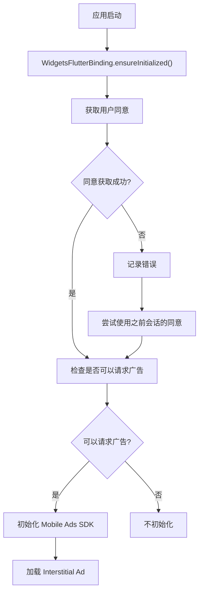
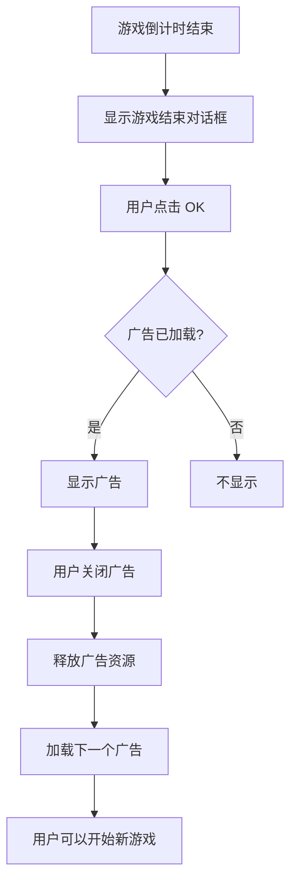

# 第 8 章：完整集成示例

## 章节简介

在本章中，我们将整合前面所有章节的知识，创建一个完整的 Interstitial Ads 集成示例。我们将展示如何将所有组件（广告加载、显示、事件处理、时机选择、同意管理）组合在一起，创建一个可以实际使用的完整应用。

## 完整项目结构

在开始之前，让我们回顾一下完整的项目结构：

```text
lib/
  ├── main.dart                    # 应用入口
  ├── consent_manager.dart         # 同意管理
  └── app_bar_item.dart           # 应用栏项（可选）
```

## 完整的 main.dart

以下是完整的 `main.dart` 实现，整合了所有功能：

```dart
import 'dart:async';
import 'dart:io';
import 'package:flutter/material.dart';
import 'package:google_mobile_ads/google_mobile_ads.dart';
import 'app_bar_item.dart';
import 'consent_manager.dart';

void main() {
  WidgetsFlutterBinding.ensureInitialized();
  runApp(const MaterialApp(home: InterstitialExample()));
}

/// An example app that loads an interstitial ad.
class InterstitialExample extends StatefulWidget {
  const InterstitialExample({super.key});

  @override
  InterstitialExampleState createState() => InterstitialExampleState();
}

class InterstitialExampleState extends State<InterstitialExample> {
  InterstitialAd? _interstitialAd;
  final _consentManager = ConsentManager();
  final _gameLength = 5;
  var _gamePaused = false;
  var _gameOver = false;
  var _isMobileAdsInitializeCalled = false;
  var _isPrivacyOptionsRequired = false;
  late var _counter = _gameLength;
  Timer? _timer;

  final String _adUnitId = Platform.isAndroid
      ? 'ca-app-pub-3940256099942544/1033173712'
      : 'ca-app-pub-3940256099942544/4411468910';

  @override
  void initState() {
    super.initState();

    _consentManager.gatherConsent((consentGatheringError) {
      if (consentGatheringError != null) {
        debugPrint(
          "${consentGatheringError.errorCode}: ${consentGatheringError.message}",
        );
      }

      // 开始第一局游戏
      _startNewGame();

      // 检查是否需要隐私选项入口
      _getIsPrivacyOptionsRequired();

      // 尝试初始化 Mobile Ads SDK
      _initializeMobileAdsSDK();
    });

    // 尝试使用之前会话的同意信息
    _initializeMobileAdsSDK();
  }

  void _startNewGame() {
    setState(() => _counter = _gameLength);
    _startTimer();
    _gameOver = false;
    _gamePaused = false;
  }

  void _pauseGame() {
    if (_gameOver || _gamePaused) {
      return;
    }
    _timer?.cancel();
    _gamePaused = true;
  }

  void _resumeGame() {
    if (_gameOver || !_gamePaused) {
      return;
    }
    _startTimer();
    _gamePaused = false;
  }

  @override
  Widget build(BuildContext context) {
    return MaterialApp(
      title: 'Interstitial Example',
      home: Scaffold(
        appBar: AppBar(
          title: const Text('Interstitial Example'),
          actions: _appBarActions(),
        ),
        body: Stack(
          children: [
            const Align(
              alignment: Alignment.topCenter,
              child: Padding(
                padding: EdgeInsets.all(15),
                child: Text(
                  'The Impossible Game',
                  style: TextStyle(fontSize: 25, fontWeight: FontWeight.bold),
                ),
              ),
            ),
            Align(
              alignment: Alignment.center,
              child: Column(
                mainAxisAlignment: MainAxisAlignment.center,
                children: [
                  Text('${_counter.toString()} seconds left!'),
                  Visibility(
                    visible: _counter == 0,
                    child: TextButton(
                      onPressed: () {
                        _startNewGame();
                        _loadAd();
                      },
                      child: const Text('Play Again'),
                    ),
                  ),
                ],
              ),
            ),
          ],
        ),
      ),
    );
  }

  List<Widget> _appBarActions() {
    var array = [AppBarItem(AppBarItem.adInpsectorText, 0)];

    if (_isPrivacyOptionsRequired) {
      array.add(AppBarItem(AppBarItem.privacySettingsText, 1));
    }

    return <Widget>[
      PopupMenuButton<AppBarItem>(
        itemBuilder: (context) => array
            .map(
              (item) => PopupMenuItem<AppBarItem>(
                value: item,
                child: Text(item.label),
              ),
            )
            .toList(),
        onSelected: (item) {
          _pauseGame();
          switch (item.value) {
            case 0:
              MobileAds.instance.openAdInspector((error) {
                _resumeGame();
              });
            case 1:
              _consentManager.showPrivacyOptionsForm((formError) {
                if (formError != null) {
                  debugPrint("${formError.errorCode}: ${formError.message}");
                }
                _resumeGame();
              });
          }
        },
      ),
    ];
  }

  /// Loads an interstitial ad.
  void _loadAd() async {
    // 检查是否可以请求广告
    var canRequestAds = await _consentManager.canRequestAds();
    if (!canRequestAds) {
      return;
    }

    InterstitialAd.load(
      adUnitId: _adUnitId,
      request: const AdRequest(),
      adLoadCallback: InterstitialAdLoadCallback(
        onAdLoaded: (InterstitialAd ad) {
          debugPrint('Ad was loaded.');
          _interstitialAd = ad;
          ad.fullScreenContentCallback = FullScreenContentCallback(
            onAdShowedFullScreenContent: (ad) {
              debugPrint('Ad showed full screen content.');
            },
            onAdFailedToShowFullScreenContent: (ad, err) {
              debugPrint('Ad failed to show full screen content with error: $err');
              ad.dispose();
            },
            onAdDismissedFullScreenContent: (ad) {
              debugPrint('Ad was dismissed.');
              ad.dispose();
              _interstitialAd = null;
              _loadAd(); // 加载下一个广告
            },
            onAdImpression: (ad) {
              debugPrint('Ad recorded an impression.');
            },
            onAdClicked: (ad) {
              debugPrint('Ad was clicked.');
            },
          );
        },
        onAdFailedToLoad: (LoadAdError error) {
          debugPrint('Ad failed to load with error: $error');
        },
      ),
    );
  }

  void _showAlert(BuildContext context) {
    showDialog(
      context: context,
      builder: (context) => AlertDialog(
        title: const Text('Game Over'),
        content: Text('You lasted $_gameLength seconds'),
        actions: <Widget>[
          TextButton(
            onPressed: () {
              Navigator.pop(context);
              // 显示广告
              _interstitialAd?.show();
            },
            child: const Text('OK'),
          ),
        ],
      ),
    );
  }

  void _startTimer() {
    _timer = Timer.periodic(const Duration(seconds: 1), (timer) {
      setState(() => _counter--);

      if (_counter == 0) {
        _gameOver = true;
        _showAlert(context);
        timer.cancel();
      }
    });
  }

  void _getIsPrivacyOptionsRequired() async {
    if (await _consentManager.isPrivacyOptionsRequired()) {
      setState(() {
        _isPrivacyOptionsRequired = true;
      });
    }
  }

  void _initializeMobileAdsSDK() async {
    if (_isMobileAdsInitializeCalled) {
      return;
    }

    if (await _consentManager.canRequestAds()) {
      _isMobileAdsInitializeCalled = true;
      MobileAds.instance.initialize();
      _loadAd();
    }
  }

  @override
  void dispose() {
    _interstitialAd?.dispose();
    _timer?.cancel();
    super.dispose();
  }
}
```

## 应用流程

### 启动流程



### 游戏结束流程



## 测试完整集成

### 测试步骤

1. **运行应用**：启动应用，观察初始化流程
2. **检查同意**：如果是首次运行，应该看到同意表单
3. **开始游戏**：游戏自动开始倒计时
4. **等待游戏结束**：等待 5 秒游戏结束
5. **观察广告**：游戏结束后应该显示广告
6. **关闭广告**：关闭广告，观察是否加载下一个广告
7. **再次游戏**：点击「Play Again」开始新游戏

### 检查日志

在控制台中，你应该看到类似以下的日志：

```text
Ad was loaded.
Ad showed full screen content.
Ad recorded an impression.
Ad was clicked.
Ad was dismissed.
Ad was loaded.  // 加载下一个广告
```

## 常见问题排查

### 广告不显示

可能的原因：

1. **SDK 未初始化**：确保调用了 `MobileAds.instance.initialize()`
2. **同意未获取**：检查 `canRequestAds()` 是否返回 `true`
3. **广告未加载**：检查 `_interstitialAd` 是否为 `null`
4. **网络问题**：检查设备网络连接

### 游戏结束后广告不显示

可能的原因：

1. **广告未加载**：确保在游戏开始前已加载广告
2. **广告已显示过**：每个广告对象只能显示一次
3. **时机不对**：确保在用户点击「OK」后才显示

### 同意表单不显示

可能的原因：

1. **不在 GDPR 地区**：使用 `DebugGeography` 测试
2. **配置错误**：检查 AdMob 控制台配置
3. **测试设备**：确保使用正确的测试设备 ID

## 实践练习

完成以下练习以巩固本章内容：

1. **整合所有组件**：将所有代码整合到一个完整的应用中
2. **测试完整流程**：测试应用启动、同意获取、游戏、广告显示等完整流程
3. **测试广告事件**：观察不同场景下的广告事件
4. **优化代码**：根据实际需求优化代码结构
5. **添加功能**：可以添加更多游戏功能或改进用户体验

## 总结检查清单

完成本章学习后，你应该能够：

- [ ] 理解完整的项目结构
- [ ] 整合所有组件创建完整应用
- [ ] 理解应用启动流程
- [ ] 理解游戏结束和广告显示流程
- [ ] 测试完整集成
- [ ] 排查常见问题
- [ ] 优化代码结构

## 下一步

现在我们已经完成了完整的集成示例。在最后一章中，我们将学习最佳实践和常见问题，帮助你避免常见错误并优化应用性能。

继续学习：[第 9 章：最佳实践与常见问题](chapter-09-best-practices.md)
