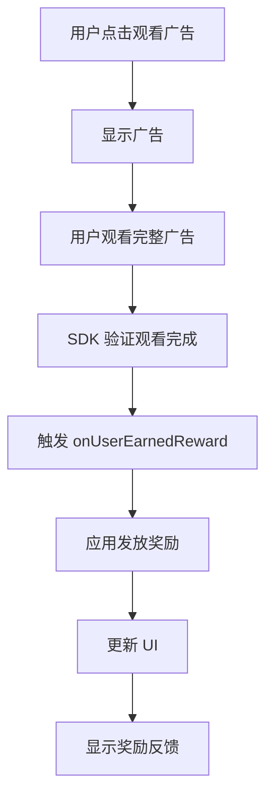

# 第 6 章：奖励机制实现

## 章节简介

在本章中，我们将学习如何实现完整的奖励机制，包括奖励类型和数量的定义、奖励发放时机、奖励存储和持久化，以及奖励显示和反馈。这是 Rewarded Ads 的核心功能之一。

## 奖励类型和数量

### 奖励类型

Rewarded Ads 可以奖励用户各种类型的应用内物品。常见的奖励类型包括：

- **虚拟货币**：coins（金币）、gems（宝石）、diamonds（钻石）等
- **游戏道具**：lives（生命）、energy（能量）、power-ups（道具）等
- **内容解锁**：levels（关卡）、characters（角色）、skins（皮肤）等
- **时间跳过**：skip_wait（跳过等待）、reduce_cooldown（减少冷却）等

### 奖励数量

奖励数量可以是：

- **固定数量**：每次观看广告获得固定数量的奖励
- **随机数量**：每次观看广告获得随机数量的奖励
- **递增数量**：连续观看广告获得递增数量的奖励

### 在 AdMob 中配置奖励

在 AdMob 控制台中创建 Rewarded 广告单元时，可以配置奖励类型和数量：

1. 创建广告单元时，设置奖励类型（如 "coins"）
2. 设置奖励数量（如 10）
3. 这些信息会在 `RewardItem` 对象中返回

## 奖励发放时机

### 标准发放时机

奖励在以下时机发放：

1. **用户观看完整广告**：用户必须观看完整广告
2. **通过 onUserEarnedReward 回调**：SDK 通过回调通知应用发放奖励

### 奖励发放流程



### 实现奖励发放

```dart
onUserEarnedReward: (AdWithoutView ad, RewardItem rewardItem) {
  debugPrint('Reward type: ${rewardItem.type}');
  debugPrint('Reward amount: ${rewardItem.amount}');
  
  // 发放奖励
  _grantReward(rewardItem);
  
  // 显示反馈
  _showRewardFeedback(rewardItem);
}
```

## 奖励存储和持久化

### 内存存储

最简单的存储方式是使用内存变量：

```dart
var _coins = 0;
var _lives = 3;
var _energy = 100;
```

**优点**：简单快速

**缺点**：应用关闭后数据丢失

### 使用 SharedPreferences 持久化

使用 `shared_preferences` 包实现持久化存储：

```dart
import 'package:shared_preferences/shared_preferences.dart';

class RewardManager {
  static const String _coinsKey = 'coins';
  static const String _livesKey = 'lives';
  
  Future<int> getCoins() async {
    final prefs = await SharedPreferences.getInstance();
    return prefs.getInt(_coinsKey) ?? 0;
  }
  
  Future<void> addCoins(int amount) async {
    final prefs = await SharedPreferences.getInstance();
    final currentCoins = prefs.getInt(_coinsKey) ?? 0;
    await prefs.setInt(_coinsKey, currentCoins + amount);
  }
  
  Future<void> setLives(int lives) async {
    final prefs = await SharedPreferences.getInstance();
    await prefs.setInt(_livesKey, lives);
  }
  
  Future<int> getLives() async {
    final prefs = await SharedPreferences.getInstance();
    return prefs.getInt(_livesKey) ?? 3;
  }
}
```

### 在奖励回调中使用

```dart
final _rewardManager = RewardManager();

onUserEarnedReward: (AdWithoutView ad, RewardItem rewardItem) async {
  if (rewardItem.type == 'coins') {
    await _rewardManager.addCoins(rewardItem.amount.toInt());
    
    // 更新 UI
    setState(() {
      _coins = await _rewardManager.getCoins();
    });
  }
}
```

## 奖励显示和反馈

### 显示奖励提示

在用户获得奖励后，应该提供清晰的反馈：

```dart
onUserEarnedReward: (AdWithoutView ad, RewardItem rewardItem) {
  // 发放奖励
  setState(() {
    _coins += rewardItem.amount.toInt();
  });
  
  // 显示奖励提示
  ScaffoldMessenger.of(context).showSnackBar(
    SnackBar(
      content: Text('You earned ${rewardItem.amount} ${rewardItem.type}!'),
      duration: Duration(seconds: 2),
      backgroundColor: Colors.green,
    ),
  );
}
```

### 显示奖励对话框

可以使用对话框显示更详细的奖励信息：

```dart
void _showRewardDialog(RewardItem rewardItem) {
  showDialog(
    context: context,
    builder: (context) => AlertDialog(
      title: Text('Reward Earned!'),
      content: Column(
        mainAxisSize: MainAxisSize.min,
        children: [
          Icon(Icons.star, color: Colors.amber, size: 48),
          SizedBox(height: 16),
          Text(
            'You earned ${rewardItem.amount} ${rewardItem.type}!',
            style: TextStyle(fontSize: 18),
          ),
        ],
      ),
      actions: [
        TextButton(
          onPressed: () => Navigator.pop(context),
          child: Text('OK'),
        ),
      ],
    ),
  );
}
```

### 更新 UI 显示

确保在获得奖励后更新 UI：

```dart
Align(
  alignment: Alignment.bottomLeft,
  child: Padding(
    padding: const EdgeInsets.all(15),
    child: Text('Coins: $_coins'),
  ),
)
```

## 完整的奖励机制实现

以下是完整的奖励机制实现示例：

```dart
class RewardManager {
  static const String _coinsKey = 'coins';
  
  Future<int> getCoins() async {
    final prefs = await SharedPreferences.getInstance();
    return prefs.getInt(_coinsKey) ?? 0;
  }
  
  Future<void> addCoins(int amount) async {
    final prefs = await SharedPreferences.getInstance();
    final currentCoins = prefs.getInt(_coinsKey) ?? 0;
    await prefs.setInt(_coinsKey, currentCoins + amount);
  }
}

class _RewardedExampleState extends State<RewardedExample> {
  var _coins = 0;
  final _rewardManager = RewardManager();
  
  @override
  void initState() {
    super.initState();
    _loadCoins();
  }
  
  Future<void> _loadCoins() async {
    final coins = await _rewardManager.getCoins();
    setState(() {
      _coins = coins;
    });
  }
  
  void _handleReward(RewardItem rewardItem) async {
    if (rewardItem.type == 'coins') {
      await _rewardManager.addCoins(rewardItem.amount.toInt());
      
      setState(() {
        _coins += rewardItem.amount.toInt();
      });
      
      ScaffoldMessenger.of(context).showSnackBar(
        SnackBar(
          content: Text('You earned ${rewardItem.amount} coins!'),
          duration: Duration(seconds: 2),
        ),
      );
    }
  }
  
  @override
  Widget build(BuildContext context) {
    return Scaffold(
      body: Stack(
        children: [
          // 应用内容
          Center(child: Text('Your app content')),
          
          // 显示金币数量
          Align(
            alignment: Alignment.bottomLeft,
            child: Padding(
              padding: const EdgeInsets.all(15),
              child: Text('Coins: $_coins'),
            ),
          ),
        ],
      ),
    );
  }
}
```

## 奖励验证

### 验证奖励有效性

在实际应用中，应该验证奖励的有效性：

```dart
onUserEarnedReward: (AdWithoutView ad, RewardItem rewardItem) {
  // 验证奖励数量
  if (rewardItem.amount <= 0) {
    debugPrint('Invalid reward amount: ${rewardItem.amount}');
    return;
  }
  
  // 验证奖励类型
  if (rewardItem.type.isEmpty) {
    debugPrint('Invalid reward type');
    return;
  }
  
  // 发放奖励
  _grantReward(rewardItem);
}
```

### 防止重复发放

可以添加检查防止重复发放奖励：

```dart
String? _lastRewardAdId;

onUserEarnedReward: (AdWithoutView ad, RewardItem rewardItem) {
  // 检查是否已经发放过奖励
  if (_lastRewardAdId == ad.adUnitId) {
    debugPrint('Reward already granted for this ad');
    return;
  }
  
  _lastRewardAdId = ad.adUnitId;
  _grantReward(rewardItem);
}
```

## 实际应用示例

### 游戏币奖励

在示例项目中，实现了游戏币奖励：

```dart
var _coins = 0;

Visibility(
  visible: _showWatchVideoButton,
  child: TextButton(
    onPressed: () {
      setState(() => _showWatchVideoButton = false);
      _rewardedAd?.show(
        onUserEarnedReward: (AdWithoutView ad, RewardItem rewardItem) {
          debugPrint('Reward amount: ${rewardItem.amount}');
          setState(() {
            _coins += rewardItem.amount.toInt();
          });
        },
      );
    },
    child: const Text('Watch video for additional 10 coins'),
  ),
)
```

## 常见问题

### 奖励没有保存

**解决方案**：使用持久化存储保存奖励：

```dart
onUserEarnedReward: (AdWithoutView ad, RewardItem rewardItem) async {
  await _rewardManager.addCoins(rewardItem.amount.toInt());
  await _loadCoins(); // 重新加载并更新 UI
}
```

### 奖励数量不正确

**解决方案**：检查 `rewardItem.amount` 的值，确保正确使用：

```dart
onUserEarnedReward: (AdWithoutView ad, RewardItem rewardItem) {
  debugPrint('Reward amount: ${rewardItem.amount}');
  debugPrint('Reward type: ${rewardItem.type}');
  
  // 确保数量大于 0
  if (rewardItem.amount > 0) {
    _coins += rewardItem.amount.toInt();
  }
}
```

### 如何实现不同类型的奖励？

可以根据 `rewardItem.type` 实现不同类型的奖励：

```dart
onUserEarnedReward: (AdWithoutView ad, RewardItem rewardItem) {
  switch (rewardItem.type) {
    case 'coins':
      _coins += rewardItem.amount.toInt();
      break;
    case 'lives':
      _lives += rewardItem.amount.toInt();
      break;
    case 'energy':
      _energy += rewardItem.amount.toInt();
      break;
    default:
      debugPrint('Unknown reward type: ${rewardItem.type}');
  }
}
```

## 实践练习

完成以下练习以巩固本章内容：

1. **实现奖励存储**：使用 SharedPreferences 实现奖励持久化
2. **实现奖励显示**：在用户获得奖励后显示提示
3. **实现多种奖励类型**：支持不同类型的奖励
4. **实现奖励验证**：验证奖励的有效性

## 总结检查清单

完成本章学习后，你应该能够：

- [ ] 理解奖励类型和数量的概念
- [ ] 实现奖励发放逻辑
- [ ] 使用 SharedPreferences 持久化奖励
- [ ] 显示奖励反馈给用户
- [ ] 实现奖励验证
- [ ] 支持多种奖励类型
- [ ] 更新 UI 显示奖励

## 下一步

现在我们已经学会了如何实现奖励机制。在下一章中，我们将学习如何实现用户同意管理（UMP），以符合 GDPR 等隐私法规的要求。

继续学习：[第 7 章：用户同意管理（UMP）](chapter-07-consent-management.md)
