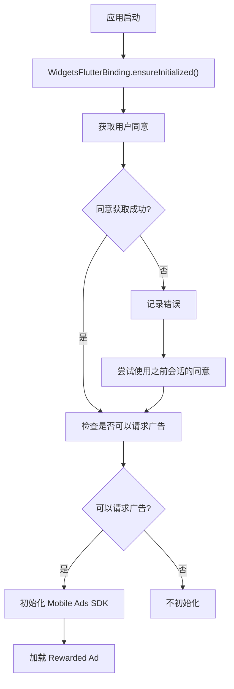
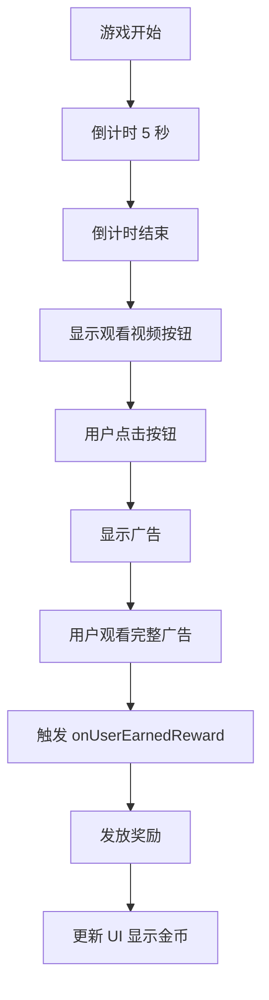

# 第 8 章：完整集成示例

## 章节简介

在本章中，我们将整合前面所有章节的知识，创建一个完整的 Rewarded Ads 集成示例。我们将展示如何将所有组件（广告加载、显示、奖励处理、事件监听、同意管理）组合在一起，创建一个可以实际使用的完整应用。

## 完整项目结构

在开始之前，让我们回顾一下完整的项目结构：

```text
lib/
  ├── main.dart                    # 应用入口
  ├── consent_manager.dart         # 同意管理
  ├── countdown_timer.dart         # 倒计时器（可选，用于示例）
  └── app_bar_item.dart           # 应用栏项（可选）
```

## 完整的 main.dart

以下是完整的 `main.dart` 实现，整合了所有功能：

```dart
import 'dart:io';
import 'package:flutter/material.dart';
import 'package:google_mobile_ads/google_mobile_ads.dart';
import 'app_bar_item.dart';
import 'consent_manager.dart';
import 'countdown_timer.dart';

void main() {
  WidgetsFlutterBinding.ensureInitialized();
  runApp(const MaterialApp(home: RewardedExample()));
}

/// An example app that loads a rewarded ad.
class RewardedExample extends StatefulWidget {
  const RewardedExample({super.key});

  @override
  RewardedExampleState createState() => RewardedExampleState();
}

class RewardedExampleState extends State<RewardedExample> {
  final _consentManager = ConsentManager();
  final CountdownTimer _countdownTimer = CountdownTimer();
  var _showWatchVideoButton = false;
  var _gamePaused = false;
  var _gameOver = false;
  var _isMobileAdsInitializeCalled = false;
  var _isPrivacyOptionsRequired = false;
  var _coins = 0;
  RewardedAd? _rewardedAd;

  final String _adUnitId = Platform.isAndroid
      ? 'ca-app-pub-3940256099942544/5224354917'
      : 'ca-app-pub-3940256099942544/1712485313';

  @override
  void initState() {
    super.initState();

    _consentManager.gatherConsent((consentGatheringError) {
      if (consentGatheringError != null) {
        debugPrint(
          "${consentGatheringError.errorCode}: ${consentGatheringError.message}",
        );
      }

      // 开始第一局游戏
      _startNewGame();

      // 检查是否需要隐私选项入口
      _getIsPrivacyOptionsRequired();

      // 尝试初始化 Mobile Ads SDK
      _initializeMobileAdsSDK();
    });

    // 尝试使用之前会话的同意信息
    _initializeMobileAdsSDK();

    // 显示"观看视频"按钮当倒计时结束时
    _countdownTimer.addListener(
      () => setState(() {
        if (_countdownTimer.isComplete) {
          _gameOver = true;
          _showWatchVideoButton = true;
          _coins += 1;
        } else {
          _showWatchVideoButton = false;
        }
      }),
    );
  }

  void _startNewGame() {
    _countdownTimer.start();
    _gameOver = false;
    _gamePaused = false;
  }

  void _pauseGame() {
    if (_gameOver || _gamePaused) {
      return;
    }
    _countdownTimer.pause();
    _gamePaused = true;
  }

  void _resumeGame() {
    if (_gameOver || !_gamePaused) {
      return;
    }
    _countdownTimer.resume();
    _gamePaused = false;
  }

  @override
  Widget build(BuildContext context) {
    return MaterialApp(
      title: 'Rewarded Example',
      home: Scaffold(
        appBar: AppBar(
          title: const Text('Rewarded Example'),
          actions: _appBarActions(),
        ),
        body: Stack(
          children: [
            const Align(
              alignment: Alignment.topCenter,
              child: Padding(
                padding: EdgeInsets.all(15),
                child: Text(
                  'The Impossible Game',
                  style: TextStyle(fontSize: 25, fontWeight: FontWeight.bold),
                ),
              ),
            ),
            Align(
              alignment: Alignment.center,
              child: Column(
                mainAxisAlignment: MainAxisAlignment.center,
                children: [
                  Text(
                    _countdownTimer.isComplete
                        ? 'Game over!'
                        : '${_countdownTimer.timeLeft} seconds left!',
                  ),
                  Visibility(
                    visible: _countdownTimer.isComplete,
                    child: TextButton(
                      onPressed: () {
                        _startNewGame();
                        _loadAd();
                      },
                      child: const Text('Play Again'),
                    ),
                  ),
                  Visibility(
                    visible: _showWatchVideoButton,
                    child: TextButton(
                      onPressed: () {
                        setState(() => _showWatchVideoButton = false);
                        _rewardedAd?.show(
                          onUserEarnedReward:
                              (AdWithoutView ad, RewardItem rewardItem) {
                                debugPrint(
                                  'Reward amount: ${rewardItem.amount}',
                                );
                                setState(
                                  () => _coins += rewardItem.amount.toInt(),
                                );
                              },
                        );
                      },
                      child: const Text('Watch video for additional 10 coins'),
                    ),
                  ),
                ],
              ),
            ),
            Align(
              alignment: Alignment.bottomLeft,
              child: Padding(
                padding: const EdgeInsets.all(15),
                child: Text('Coins: $_coins'),
              ),
            ),
          ],
        ),
      ),
    );
  }

  List<Widget> _appBarActions() {
    var array = [AppBarItem(AppBarItem.adInpsectorText, 0)];

    if (_isPrivacyOptionsRequired) {
      array.add(AppBarItem(AppBarItem.privacySettingsText, 1));
    }

    return <Widget>[
      PopupMenuButton<AppBarItem>(
        itemBuilder: (context) => array
            .map(
              (item) => PopupMenuItem<AppBarItem>(
                value: item,
                child: Text(item.label),
              ),
            )
            .toList(),
        onSelected: (item) {
          _pauseGame();
          switch (item.value) {
            case 0:
              MobileAds.instance.openAdInspector((error) {
                _resumeGame();
              });
            case 1:
              _consentManager.showPrivacyOptionsForm((formError) {
                if (formError != null) {
                  debugPrint("${formError.errorCode}: ${formError.message}");
                }
                _resumeGame();
              });
          }
        },
      ),
    ];
  }

  /// Loads a rewarded ad.
  void _loadAd() async {
    var canRequestAds = await _consentManager.canRequestAds();
    if (!canRequestAds) {
      return;
    }

    RewardedAd.load(
      adUnitId: _adUnitId,
      request: const AdRequest(),
      rewardedAdLoadCallback: RewardedAdLoadCallback(
        onAdLoaded: (ad) {
          ad.fullScreenContentCallback = FullScreenContentCallback(
            onAdShowedFullScreenContent: (ad) {},
            onAdImpression: (ad) {},
            onAdFailedToShowFullScreenContent: (ad, err) {
              ad.dispose();
            },
            onAdDismissedFullScreenContent: (ad) {
              ad.dispose();
            },
            onAdClicked: (ad) {},
          );

          _rewardedAd = ad;
        },
        onAdFailedToLoad: (LoadAdError error) {
          print('RewardedAd failed to load: $error');
        },
      ),
    );
  }

  void _getIsPrivacyOptionsRequired() async {
    if (await _consentManager.isPrivacyOptionsRequired()) {
      setState(() {
        _isPrivacyOptionsRequired = true;
      });
    }
  }

  void _initializeMobileAdsSDK() async {
    if (_isMobileAdsInitializeCalled) {
      return;
    }

    if (await _consentManager.canRequestAds()) {
      _isMobileAdsInitializeCalled = true;
      MobileAds.instance.initialize();
      _loadAd();
    }
  }

  @override
  void dispose() {
    _rewardedAd?.dispose();
    _countdownTimer.dispose();
    super.dispose();
  }
}
```

## 应用流程

### 启动流程



### 游戏和奖励流程



## 测试完整集成

### 测试步骤

1. **运行应用**：启动应用，观察初始化流程
2. **检查同意**：如果是首次运行，应该看到同意表单
3. **开始游戏**：游戏自动开始倒计时
4. **等待游戏结束**：等待 5 秒游戏结束
5. **观察按钮**：应该看到「观看视频获得额外 10 个金币」按钮
6. **点击按钮**：点击按钮观看广告
7. **观察奖励**：观看完整广告后应该获得奖励，金币数量增加
8. **再次游戏**：点击「Play Again」开始新游戏

### 检查日志

在控制台中，你应该看到类似以下的日志：

```text
Ad was loaded.
Ad showed full screen content.
Ad recorded an impression.
Ad was clicked.
Reward amount: 10
Ad was dismissed.
Ad was loaded.  // 加载下一个广告
```

## 常见问题排查

### 广告不显示

可能的原因：

1. **SDK 未初始化**：确保调用了 `MobileAds.instance.initialize()`
2. **同意未获取**：检查 `canRequestAds()` 是否返回 `true`
3. **广告未加载**：检查 `_rewardedAd` 是否为 `null`
4. **网络问题**：检查设备网络连接

### 奖励没有发放

可能的原因：

1. **用户未完整观看广告**：只有完整观看广告才会触发奖励
2. **回调未实现**：确保实现了 `onUserEarnedReward` 回调
3. **奖励数量为 0**：检查 `rewardItem.amount` 是否大于 0

### 同意表单不显示

可能的原因：

1. **不在 GDPR 地区**：使用 `DebugGeography` 测试
2. **配置错误**：检查 AdMob 控制台配置
3. **测试设备**：确保使用正确的测试设备 ID

## 实践练习

完成以下练习以巩固本章内容：

1. **整合所有组件**：将所有代码整合到一个完整的应用中
2. **测试完整流程**：测试应用启动、同意获取、游戏、广告显示、奖励发放等完整流程
3. **测试奖励功能**：验证奖励是否正确发放和显示
4. **优化代码**：根据实际需求优化代码结构
5. **添加功能**：可以添加更多游戏功能或改进用户体验

## 总结检查清单

完成本章学习后，你应该能够：

- [ ] 理解完整的项目结构
- [ ] 整合所有组件创建完整应用
- [ ] 理解应用启动流程
- [ ] 理解游戏和奖励流程
- [ ] 测试完整集成
- [ ] 排查常见问题
- [ ] 优化代码结构

## 下一步

现在我们已经完成了完整的集成示例。在最后一章中，我们将学习最佳实践和常见问题，帮助你避免常见错误并优化应用性能。

继续学习：[第 9 章：最佳实践与常见问题](chapter-09-best-practices.md)
